# Developer Guide

## Acknowledgements

* Inspired by [AddressBook-Level3 (AB3) DG](https://se-education.org/addressbook-level3/DeveloperGuide.html#architecture).

## Quick Start
1. Ensure that you have Java 11 or above installed on your computer.
2. Download the latest `Fridget.jar` from [here](https://github.com/AY2122S1-CS2113T-W12-4/tp/releases/download/v2.1/Fridget.jar).
3. Copy the file into the folder you want to store Fridget's data.
4. Launch the terminal in that same folder on your computer. You can refer to [this website](https://towardsdatascience.com/a-quick-guide-to-using-command-line-terminal-96815b97b955) on how to launch the terminal on your specific OS (Windows/Mac/Linux).
5. Type in `java -jar Fridget.jar` into the terminal to launch the app.
6. Type your command in the command box and press Enter to execute it.
   * Some example commands you can try:
      - help: lists all commands and input format.
      - reset: prompts the user to confirm clearing all data.
      - exit: close the app.
7. Congratulations! You should be good to go!

:bulb: You can type <code>java -version</code> into your terminal to check your version of java.

## Setting Up In Intellij

For more information regarding how to install this project into your local repo, do take a look at the README.md [here](https://github.com/AY2122S1-CS2113T-W12-4/tp).

## Index

1. [Architecture](#architecture)
   1. [Architecture Components](#architecture-components)
   2. [Architecture Logic](#architecture-logic)
2. [Implementations](#implementations)
   1. [Adding Items Into Fridget](#adding-items-into-fridget)
   2. [Removing Items From Fridget](#removing-items-from-fridget)
   3. [Getting Help In Fridget](#getting-help-in-fridget)
   4. [Resetting Item List in Fridget](#resetting-item-list-in-fridget)
   5. [Resetting Shopping List in Fridget](#resetting-shopping-list-in-fridget)
   6. [Listing Items In Fridget](#listing-items-in-fridget)
   7. [Listing Expiring Items In Fridget](#listing-expiring-items-in-fridget)
   8. [Finding Items In Fridget](#finding-items-in-fridget)
   9. [Listing Items In Shopping List](#listing-items-in-shopping-list)
   10. [Configuring Notifications](#configuring-notifications)
3. [Product Scope](#product-scope)
   1. [Target User Profile](#target-user-profile)
   2. [Value Proposition](#value-proposition)
4. [User Stories](#user-stories)
5. [Non-Functional Requirements](#non-functional-requirements)
6. [Glossary](#glossary)
7. [Instructions For Manual Testing](#instructions-for-manual-testing)
   1. [Launch And Shutdown](#launch-and-shutdown)
   2. [Adding Items](#adding-items)
   3. [Deleting Items](#deleting-items)
   4. [Listing Items](#listing-items)
   5. [Finding Items](#finding-items)
   6. [List Expiring Items](#list-expiring-items)
   7. [Printing Notification](#printing-notification)
   8. [Updating Items Quantity](#updating-items-quantity)
   9. [Saving And Loading Data](#saving-and-loading-data)

## Architecture

### Architecture Components

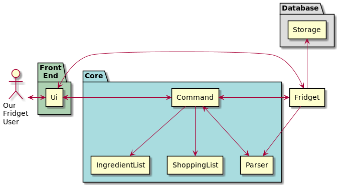

This diagram illustrates the basic concept that underlies Fridget.

Each rectangle above represents a class that exists to make Fridget work. 
The larger folders represent the main purpose of the classes inside it.
Their functions are as follows:

### <ins>**Front End**</ins>

The front end aims to handle:
- Reading <ins>inputs</ins> from the user
- Sending <ins>outputs</ins> to the user

#### `Ui`

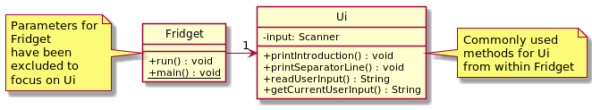

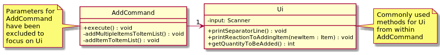

The Ui manages the entirety of the front end. Classes like Fridget and XYZCommand shown above use it to:
- collect user input and store it.
- print any necessary output to the terminal.

### <ins>**Core**</ins>

The core aims to understand and execute the user's commands.

#### `Parser`

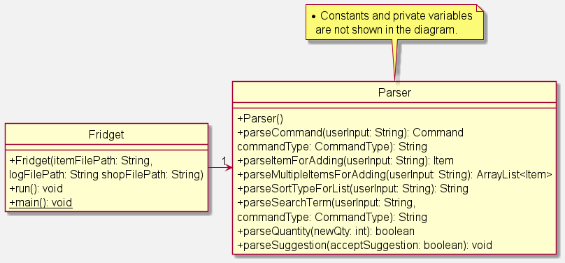

Above is the image representing the association between Fridget and Parser.

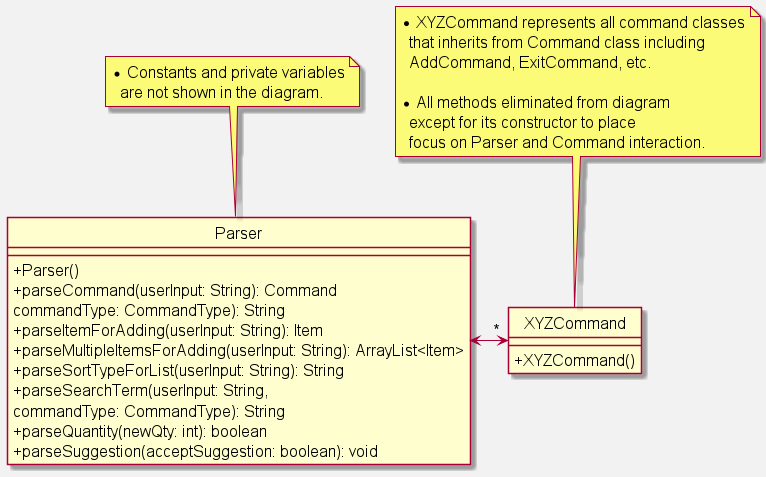

Above is the image representing the association between Parser and other XYZCommand classes.

The Parser collects information from the user's input in a way that is usable by other classes within Fridget.

#### `ItemList`

This ItemList keeps track of all items currently stored within Fridget, and can be easily manipulated.

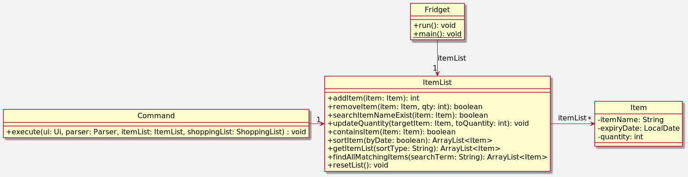

Above is the image representing the association between Fridget, Command, ItemList and Item.
The ItemList stores a list of Items and contains methods to help add, remove or process Items in the list.

#### `ShoppingList`

This ShoppingList keeps track of all items the user may want to shop for, and can be easily manipulated.

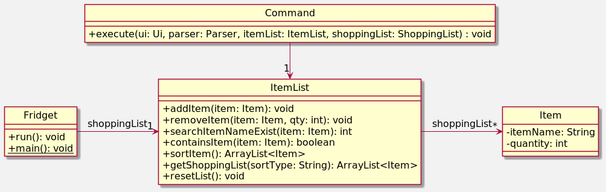

Above is the image representing the association between Fridget, Command, and Item.
The ShoppingList stores the list of Items in the shopping list and contains methods to help process add, remove or process Items in the shoppping list.

#### `Command`

There is a Command class for each possible command the user could execute.
Each Command class controls the Ui, Parser, ItemList, and ShoppingList so the User's intended outcome is achieved.

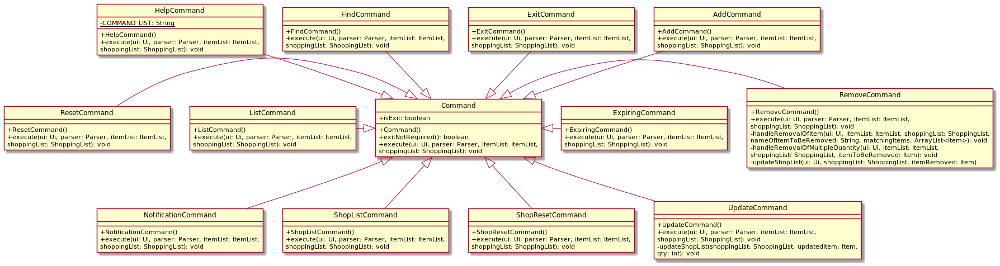

The Command class is inherited by its respective subclasses (XYZCommand classes), which have their own specific functionalities.

The Command class contain an `execute()` method which is overridden by all other classes to execute the
functionality specific to that class. Examples of specific commands include `AddCommand`, `RemoveCommand` and more.

### <ins>**Database**</ins>

The Database stores all info that is needed on a permanent basis. This may
include info such as the contents of ItemList. Most info in the Database
is stored after any changes, and is usually retrieved when Fridget is turned
on.

#### `Storage`

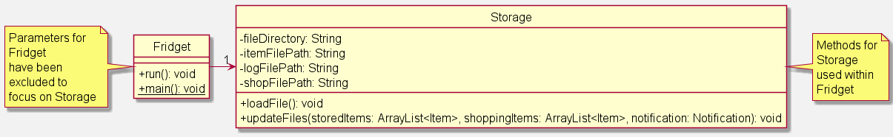

The Storage class takes charge of storing items after every command, and
retrieving them upon startup. The Storage class is also responsible for 
printing timely health and expiry notification.

### <ins>**Fridget**</ins>

#### `Fridget`

Fridget initialises all classes upon startup as shown below. 

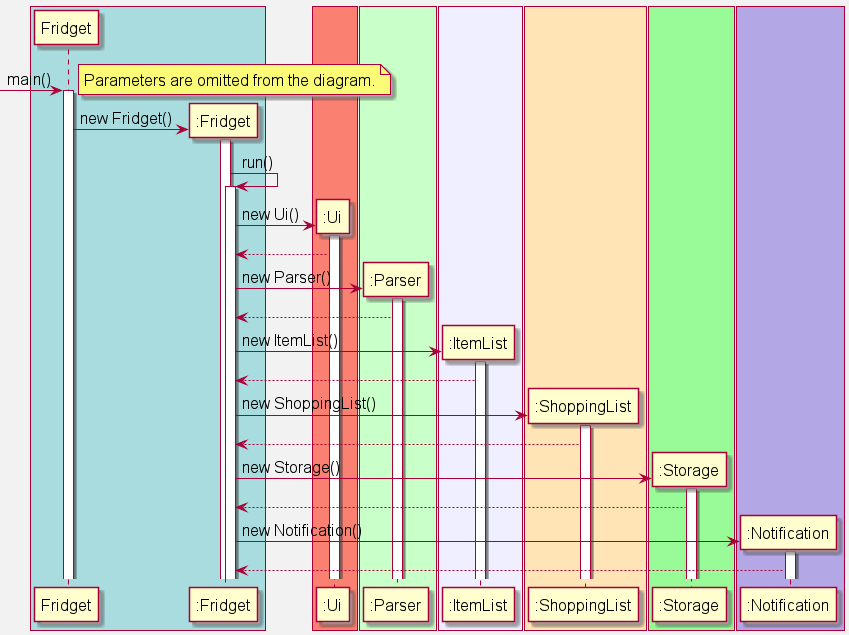

Fridget also initiates the user feedback loop as shown below.

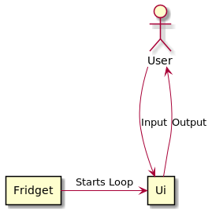

### Architecture Logic

The overall flow within Fridget occurs in three stages:

- Startup
- Execution
- Shutdown

#### Startup

1. The `main` method in Fridget creates a new instance of `Fridget`.
2. This new instance creates new instances of `Ui`, `Parser`,`ItemList`, `ShoppingList`, and `Storage`.
3. `Fridget.run()` is called, which asks `Storage` to check stored files in the directory: `fridgetData`.
4. If no such files exist, `Storage` creates the files in the directory `fridgetData` for future usage.
5. If files have already been created, `ItemList` and `ShoppingList` is updated based on the info obtained.
6. `Fridget.run()` initiates the user feedback loop, to obtain input from the user.

#### Execution

1. The user types in an input into the `Ui`. `Parser` is used to extract a `Command` from the user's input.
2. `Command.execute()` is called to execute the command.
3. The `Command` takes control of the `Ui`, `ItemList`, and `ShoppingList` to achieve the intended outcome the user requires.
4. Once `Command.execute()` has ceased, the `Ui` awaits further input from the user.

#### Shutdown

1. When the `Ui` receives an input containing `exit`, `Parser` extracts an `ExitCommand`.
2. This `ExitCommand` prints a message to let the user know Fridget is shutting down.
3. `Fridget` recognises that `ExitCommand.exitNotRequired()` is not false, and shuts down Fridget safely.

## Implementations

### Adding Items Into Fridget

#### Main Objectives:

The functionality to add items is bound by two main objectives:
* Make adding items convenient for the user
* Parse enough information about the item to benefit the user in the future

As a result, the current iteration requires three pieces of info from the user:
* The name of the item
* The expiry date of the item
* The quantity of the item to be added

This is done to minimize the input required from the user per entry, while maximising future uses with the data.

Future uses include:
* Finding if an item exists by searching for its name
* Combining items with similar names and expiry together
* Sort all items by expiry date
* Remind users of expiring items by name
* Update quantity of items already in itemList

#### Overall Sequence:

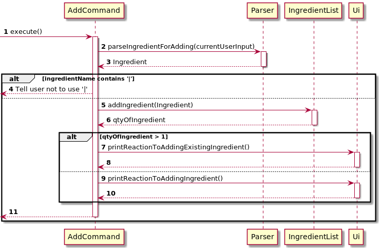

Step 1:

This step is almost always initiated by Fridget, but could potentially be done by another class in the future.

Step 2 & 3:

The currentUserInput is retrieved from the Ui using the method getCurrentUserInput()

Step 4 & 5:

If the user input contains `;`, it means that the user wants to add multiple items. Hence, the parser is called to parse the user input and return an ArrayList of Items the user wants to add called newItems.

Steps 6 & 7:

The addMultipleItemsToItem() method is called to add all items in newItems. More information can be found [below](#addmultipleitemstoitemlist).

Steps 8 & 9:

If there is no `;` in the currentUserInput, the user only wants to add one item. A new Item is parsed using the parser method: parseItemForAdding().

Step 10 & 11:

The addItemToItemList() method is called to add the newItem to the ItemList.

Step 12:

The execution of the execute() method ends.

#### addMultipleItemsToItemList

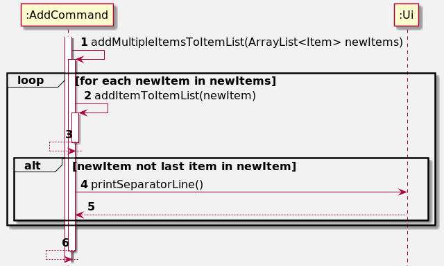

Step 1:

The addMultipleItemsToItemList() method is called by AddCommand, with the ArrayList of Items to add(newItem) as a parameter.

Step 2 & 3:

The addItemToItemList() method is called on each item in the list. More information can be found [below](#additemtoitemlist).

Step 4 & 5:

The printSeparatorLine() method in Ui is called to separate the output created by the addition of one item from the next. It is only not called for the last Item in newItems.

Step 6:

The execution of the addMultipleItemsToItemList() method ends.

#### addItemToItemList

Step 1:

The addItemToItemList() method is called from within AddCommand.

Step 2 & 3:

AddCommand calls getQuantityToBeAdded() in Ui to read the input from the user to determine the quantity of the item to be added (qtyToBeAdded).

Step 4 & 5:

AddCommand calls addItem(newItem) in ItemList to add the newItem into the ItemList. This method returns the final quantity of the item left.

Step 6 & 7:

If the original quantity of the item was greater than 0, printReactionToAddingExistingIngredient() is called in Ui to acknowledge to the user that the item had already existed in the fridge.

Step 8 & 9:

If the original quantity of the item was 0, printReactionToAddingItem() is called in Ui to acknowledge to the user that the item had not existed in the fridge previously.

Step 10 & 11:

AddCommand calls removeItem() in ShoppingList to remove added item from the shopping list only if it exists.

Step 12:

The execution of the addItemToItemList() method ends.

### Removing Items From Fridget

#### Main Objectives:

The functionality of remove items is bound by two main objectives:
- Make removing items more convenient for the user.
- Prompts the user to add item to shopping list if removed item does not exist (no other items with the same name) in the item list.

#### Overall Sequence: 
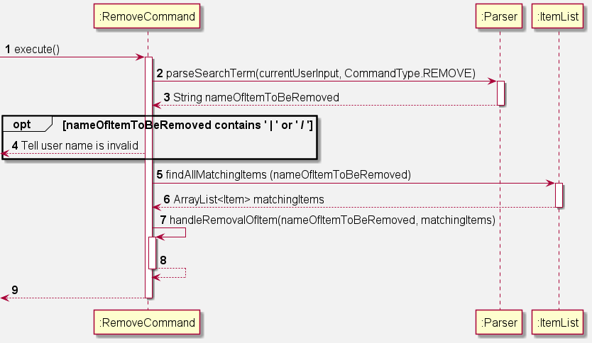

Step 1:

This step is almost always initiated by Fridget, but could potentially be done by another class in the future.

Step 2 & 3:

The parseSearchTerm() method is called in the Parser to read the user input and returns the name of the item to be removed.

Step 4:

If the name of the item contains `|` or `/`, a FridgetException is thrown to tell the user that the name is invalid. The execution of the execute() method ends.

Step 5 & 6:

The findAllMatchingItems() method is called in the ItemList to find all items with matching names. This method returns an arraylist of the items with matching names.

Step 7 & 8:

The handleRemovalOfItem() method is called to remove the items from the list. More info about this method can be found [below](#handleremovalofitem).

Step 9:

The execution of the execute() method ends.

#### handleRemovalOfItem

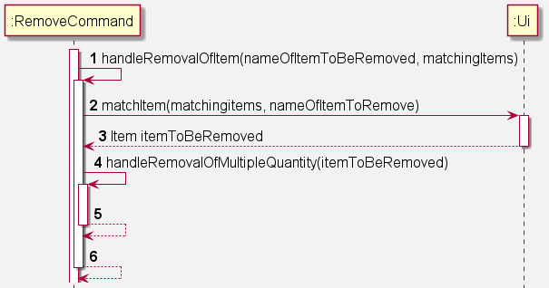

Step 1:

This step is almost always initiated by Fridget, but could potentially be done by another class in the future.

Step 2 & 3:

The matchItem() method is called in the Ui to print the list of matching items and prompt the user to pick the correct match. This method returns the item that the user wants to remove.

Step 4 & 5:

The handleRemovalOfMultipleQuantity() method is called to remove the item of choice. More info about this method can be found [below](#handleremovalofmultiplequantity).

Step 6:

The execution of the handleRemovalOfItem() method ends.

#### handleRemovalOfMultipleQuantity

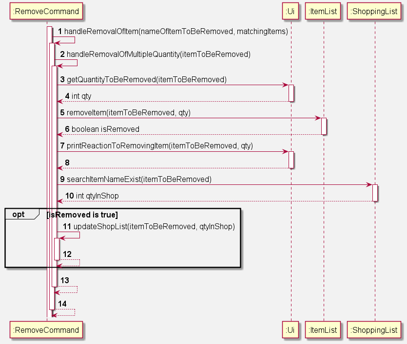

Step 1 & 2: 

The handleRemovalOfMultipleQuantity() method is initiated by the handleRemovalOfItem() method.

Step 3 & 4:

The getQuantityToBeRemoved() method is called in the Ui to ask the user how many items to remove. This method returns the quantity of item to be removed.

Step 5 & 6:

The removeItem() method is called in the ItemList and removes the item from the item list. This method returns a true if there are no more items with the same name in the item list.

Step 7 & 8:

The printReactionToRemovingItem() method is called in the Ui and prints the remove messaged to the user.

Step 9 & 10:

The searchItemNameExist() method is called in the ShoppingList to check if any item has the same name as the removed item. This method returns the quantity of the item with same name.

Step 11 & 12:

If there are no more items in the item list with the same name as the removed item, the updateShopList() method is called to prompt user to add item into the shopping list. More info about this method can be found [below](#updateshoppinglist).

#### updateShoppingList

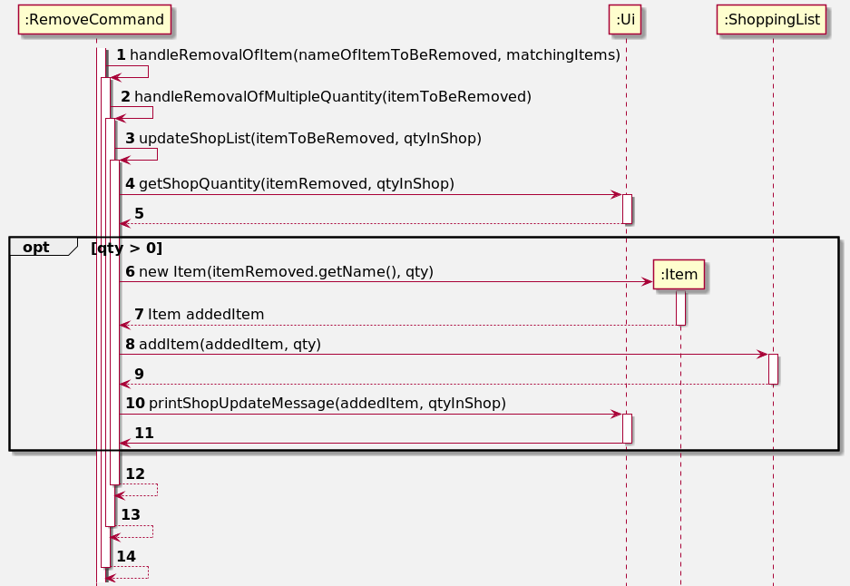

Step 1 - 3:

The updateShoppingList() method is initiated by handleRemovalOfMultipleQuantity().

Step 4 & 5:

The getShopQuantity method is called in the Ui to ask the user how many items to add into the shopping list. This method returns the quantity to be added into the shopping list.

Step 6 & 7:

If quantity to add is more than 0, a new Item to be added is created.

Step 8 & 9:

The addItem() method is called in the ShoppingList and adds the previously created item into the shopping list.

Step 10 & 11:

The printShopUpdateMessage() method is called in the Ui and prints the acknowledgement message.

Step 12 - 14:

The execution of the updateShopList() method ends.

### Getting Help In Fridget

#### Main Objectives:

The objective of a help manual in Fridget is to ensure users are equipped with the basic knowledge to get started with Fridget.

It also ensures that Fridget is convenient and reduces the need for the user to reference the User Guide.

Future uses include:
* More in-depth coverage of all basic functions.
* Interactive component to explore capabilities of each command.

#### Overall Sequence:

Step 1:

This step is almost always initiated by Fridget, but could potentially be done by another class in the future.

Step 2 & 3:

The printLine() method is called in the Ui which prints out the String that is input into the method,
in this case it is the help manual.

Step 4:

The execution of the execute() method ends.

### Resetting Item List In Fridget

#### Main Objectives:

The objective of the reset functionality is to provide users an easy way to remove all the items in Fridget.

#### Overall Sequence:

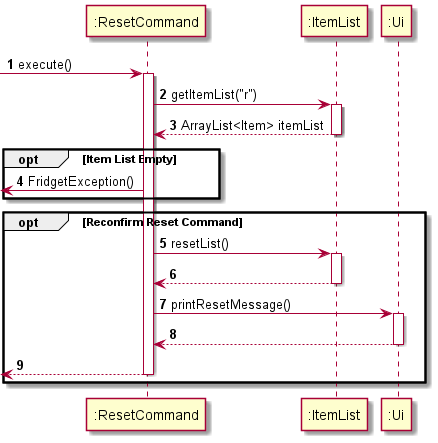

Step 1: 

This step is almost always initiated by Fridget, but could potentially be done by another class in the future.

Step 2 & 3:

The getItemList() method is called in the ItemList, and the current itemList is returned.

Step 4:

If returned itemList is empty, a FridgetException is thrown and the command exits. Else, it will continue to step 5.

Step 5 & 6: 

If the user double confirms the reset command, the resetList() method is called in the ItemList and resets 
the item list by overwriting it with a new item list.

Step 7 & 8:

The printResetMessage() method is called in the Ui, and prints a String stating that the item list has been reset.

Step 9:

The execution of the execute() method ends.

### Resetting Shopping List in Fridget

#### Main Objective:

The objective of the reset functionality is to provide users an easy way to remove all the items in the shopping list.

#### Overall Sequence:

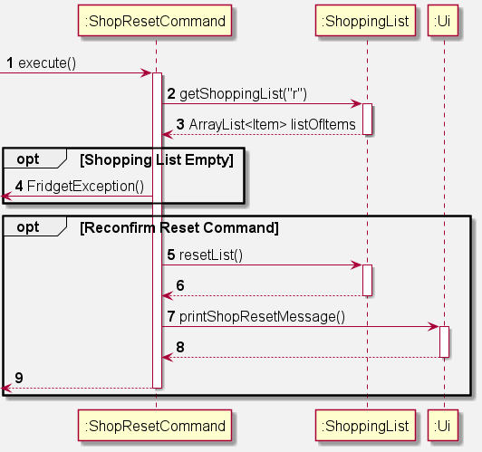

Step 1:

This step is almost always initiated by Fridget, but could potentially be done by another class in the future.

Step 2 & 3:

The getShoppingList() method is called in the ShoppingList, and the current shoppingList is returned.

Step 4:

If the shoppingList is empty, a FridgetException is thrown. Otherwise, it will continue to step 5.

Step 5 & 6:

The resetList() method is called in the ShoppingList, and resets the shoppingList by overwriting it with a new shoppingList.

Step 7 & 8:

The printShopResetMessage() is called in the Ui, and prints a String stating that the shoppingList had been reset.

Step 9:

The execution of the execute() method ends.

### Listing Items In Fridget

#### Main Objectives:

The functionality to list items is bound by two main objectives:
* Allow users to easily view the contents of Fridget.
* Allow users to choose their preferred sort type.

As a result, the current iteration optionally checks for an additional parameter from the user:
* The sort type of the list.

This additional parameter is optional as the list is sorted by item name by default.

#### Overall Sequence:

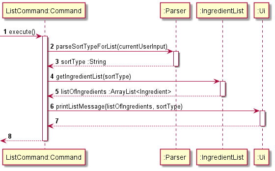

Step 1:

This step is almost always initiated by Fridget, but could potentially be done by another class in the future.

Step 2 & 3:

The parseSortTypeForList() method is called in Parser, with the currentUserInput as a parameter.
The parser returns a String as sortType with the detected sort type in the user input.

Step 4 & 5:

The getItemList() method is called in ItemList, with the sortType as a parameter.
The ItemList returns an ArrayList<Item> as listOfItems that are sorted according to the sort type.

Step 6 & 7:

The printListMessage() method is called in Ui, with the listOfItem, and sortType as parameters.
The Ui prints out the list of Items for the user.

Step 8:

The execution of the execute() method ends.

### Listing Expiring Items In Fridget
#### Main Objectives:

The functionality to list expiring items is bound by one objective:
* Allow users to easily view all expired or expiring items in Fridget.

The current iteration always lists items according to the expiry dates of the items. This is done so that items closer to expiry will be shown at the top of the list.

#### Overall Sequence:
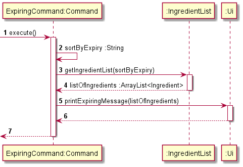

Step 1:

This step is almost always initiated by Fridget, but could potentially be done by another class in the future.

Step 2:

String "e" is assigned to sortByExpiry.

Step 3 & 4:

The getItemList() method is called in ItemList, with sortByExpiry as a fixed parameter.
The ItemList returns an ArrayList<Item> as listOfItems that are sorted according to expiry dates.

Step 5 & 6:

The printListMessage() method is called in UI, with the listOfItem as parameter.
The Ui prints out the list of Expiring Items for the user.

Step 8:

The execution of the execute() method ends.

### Finding Items In Fridget

#### Main Objectives:

The functionality to find items is bound by two main objectives:
* Allow users to easily find the list of items in Fridget that has similarities to search term.

As a result, the current iteration requires an info from the user:
* The name of the item sought.

This additional info is to be used to be compared to every item in the list.

#### Overall Sequence:

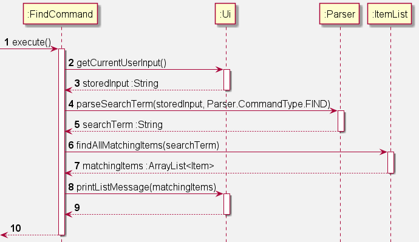

Step 1:

This step is almost always initiated by Fridget, but could potentially be done by another class in the future.

Step 2 & 3:

The getCurrentUserInput() method is called in Ui.
The Ui returns a String as storedInput which is the user input.

Step 4 & 5:

The parseSearchTerm() method is called in Parser, with storedInput and Parser.CommandType.FIND as parameters.
The Parser returns a String as searchTerm.

Step 6 & 7:

The findAllMatchingItems() method is called in ItemList with searchTerm as a parameter.
The ItemList returns an ArrayList<Item> as matchingItems for the user.

Step 8 & 9:

The printListMessage() method is called in Ui, with the matchingItems.
The Ui prints out the list of Items for the user.

Step 10:

The execution of the execute() method ends.

### Listing Items In Shopping List

#### Main Objectives:
The objective of this functionality is to allow users to easily view the contents of the shopping list.

#### Overall Sequence:

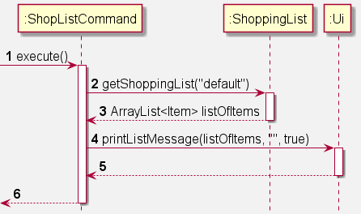

Step 1:

This step is almost always initiated by Fridget, but could potentially be done by another class in the future.

Step 2 & 3:

The getShoppingList() method is called in ShoppingList, and returns the current shoppingList.

Step 4 & 5:

The printListMessage() method is called in Ui, and prints out the list of items in the shoppingList.

Step 6:

The execution of the execute() method ends.

### Configuring Notifications 

#### Main Objectives:

The objective of the notification based on current functionality is to print out a reminder notification 
to remind users to eat healthily and inform them of expiring or expired items.

Current implementation allow users to toggle the notifications on or off, with reminders sent out at intervals of 4 hours.

The purpose of implementing time interval and ability to toggle on or off is to prevent excessive notification printing. 

#### Overall Sequence:

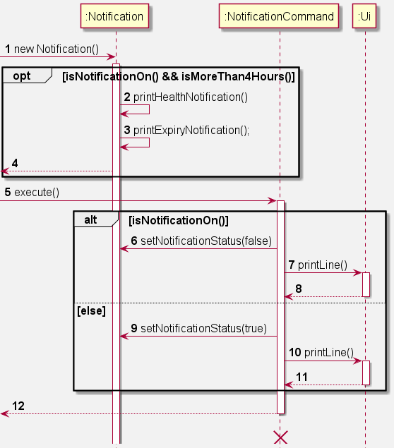

Step 1:

This step is almost always initiated by Fridget, but could potentially be done by another class in the future.

Step 2 & 3:

The printNotification() method is called which will run if notification is turned on and time interval from previous
notification is longer than 4 hours. After satisfying the command, printHealthNotification() and printExpiryNotification()
is executed to print out the notifications. All methods called in these steps are called in Notification.

Step 4:

Health and expiry notification is printed when method is called and a new date and time is recorded into the log file.

Step 5:

This step is initiated by Fridget to run execute() method.

Step 6

If isNotificationOn() is true, the method setNotificationStatus(false), called in Notification class, is executed to set notification status 
to false in order to turn off printing of notification.

Step 7 & 8:

The printLine() method is called in the Ui, to print a message to notify user that notification has been switched off.

Step 9:

If isNotificationOn() is false, the method setNotificationStatus(true), called in Notification class, is executed to set notification status
to true in order to turn on printing of notification.

Step 10 & 11:

The printLine() method is called in the Ui, to print a message to notify user that notification has been switched off.

Step 12:

The execution of the execute() method ends, while notification continues to run until program termination.

### Exiting From Fridget

## Product scope
### Target user profile

Fridget aims to help tech-savvy families who cook at home, buy groceries, and own a fridge.

### Value proposition

Nowadays, fridges are operated manually. Hence, users need to go through item by item manually to perform any function related to their fridge, for example:
* Figuring out what food is close to expiring 
* Figuring out if they have enough items for a certain recipe 
* Figuring out if they are any recipes that they can make with their items 
* Adding/removing items into/from the fridge and storing it in a ledger
* Find out items that need to be bought soon

This CLI based application hopes to automate a lot of the tasks users have relating to the fridge, for example:
* Automated reminder for items nearing expiry or items requiring replenishment 
* Automated housekeeping: Storing items that are added/removed in a central ledger 
* Automated shopping list: Listing out missing items for meals that users want to cook

## User Stories

|Version| As a ... | I want to ... | So that I can ...|
|--------|----------|---------------|------------------|
|v1.0|busy house-husband|easily find out if I have a certain item in the fridge|spend less time checking through my Fridge|
|v1.0|busy house-husband|easily add or remove an item into the Fridget|spend less time writing down and scratching out items on a written ledger|
|v1.0|busy house-husband|easily find out expiry date of item|spend less time going through every item.|
|v1.0|frugal house-husband|know what foods are about to expire|quickly use them before they become inedible|
|v1.0|perfectionist house-husband|reset the list of items in Fridget|start using Fridget after not using it for a while, or after initial testing with fake items|
|v1.0|new user|have a manual instructions|easily navigate through the cli app|
|v1.0|fitness fanatic|have health-focused reminders for family members to eat more fruits and healthy snacks|my family can be healthy together|
|v2.0|busy house-husband|check if any item requires me to replenish|easily curate my shopping list|
|v2.0|lazy house-husband|update the amount that is left of the item|know if it is very urgent to consume when it nears expiry|
|v2.0|lazy house-husband|be able to add multiple items at once|type lesser commands to add them in|
|v2.1|forgetful house-husband|be reminded on items nearing expiry|use it before its too late|

## Non-Functional Requirements

1. Fridget should operate on any common OS with Java `11` installed.
2. A user with a fast typing speed should be able to fully optimize their usage of Fridget, compared to a GUI application.

## Glossary

**Common OS**: Windows, Linux, OS X

**CAPITALISE_WORDS**: Represents the description of the required user input.

**XYZCommand**: Represents a specific command class.

**GUI**: Graphical User Interface

:bulb:: This icon refers to tips that may help you.

:exclamation:: This icon refers to warnings to help you avoid mistakes.

## Instructions For Manual Testing

### Launch And Shutdown
1. Initial launch
   1. Download the jar file, [Fridget.jar](https://github.com/AY2122S1-CS2113T-W12-4/tp/releases/download/v2.1/Fridget.jar) and copy into empty folder.
   2. Double-click the file to launch the app or enter command `java -jar Fridget.jar` into command window to start the program.  

2. Shutting down
   1. A typical file shutdown would be using `exit` command. Items added will be retained and saved in the text file and loaded on next launch.
   2. Exiting by closing the window is permitted but not encouraged.

### Adding Items
1. Adding item to Fridget.
   1. You can add items using the following format: `add ITEM_NAME /EXPIRY_DATE`.
   2. `ITEM_NAME` is the parameter for the name and `EXPIRY_DATE` will be in the format of <ins>YYYY-MM-DD</ins>
   3. A prompt would appear to ask for quantity you want to add simply input the quantity.  

2. Test cases:
   1. `add bacon /2022-12-12` followed by `1` 
      **Expected**: Message will be printed to inform you item is added. Type command `list` to view the item added to Fridget.  
   2. `add bacon /2022-12-12` followed by `5` 
      **Expected**: Message will be printed to inform you the increase in number of items added from 1 to 6 quantity.  
   3. `add burger /2022-12-12 ; chicken /2022-12-12` followed by `1` and `1` 
      **Expected**: Message will be printed to inform you that both items are added.  
   4. `add bacon` 
      **Expected**: Error message printed to prompt that there is lack of expiry date. No item added.  
   5. `add /2022-11-11` 
      **Expected**: Error message printed to indicate the lack of item name. No item will be added.  
   6. `add bacon /2021-13-13` 
      **Expected**: Error message to inform that date is in the wrong format. No item will be added.  
   7. `add | /2022-12-12` 
      **Expected**: Error message to inform user to not input '|' in item name. No item will be added.  
   8. `add ; /2022-12-12` 
      **Expected**: Error message to inform user that item name is missing. No item will be added.  
   9. `add / /2022-12-12` 
      **Expected**: Error message to inform user that item name is missing. No item will be added.  
   10. `add bacon /2020-12-12` 
       **Expected**: Error message to inform user that item has expired [number of days from today] days ago. No item will be added.  

### Deleting Items
1. Removing item from Fridget.
   1. You can remove items using the following format: `remove ITEM_NAME`.
   2. `ITEM_NAME` is the parameter for the name.
   3. If there are multiple items with same name, Fridget will prompt you to choose the index of item to remove.
   4. If there are multiple quantities of an item, Fridget will prompt you to input the quantity to remove.  

2. Prerequisites: There should be a prepared list of items in Fridget.
   1. Add 3 `bacon` of different dates. (e.g. 2021-11-11, 2021-12-12)
   2. Add 3 `egg` of same date.  

3. Test Cases:
   1. `remove bacon` 
      **Expected**: Prompt from Fridget to ask which of the item from a list to remove. Type 1, and first bacon from
      the list will be removed. Type `list` to confirm the right bacon (correct date) is removed.  
   2. `remove egg` 
      **Expected**: Prompt to type in the quantity to remove, type in 2 and a message will be printed to
      notify that 2 eggs have been removed. Type `list` to check quantity of egg.  
   3. `remove` 
      **Expected**: Error message printed to indicate the lack of item name. No item will be removed.  
   4. `remove chicken` 
      **Expected**: Error message printed to inform you no such item exists.  

### Listing Items
1. Listing all items from Fridget.
   1. Format for list will be `list` or `list -r` or `list -e`
   2. `list`: list by alphabetical order.
   3. `list -e`: list by ascending order of expiry date.
   4. `list -r`: list by how recent item is added.  

2. Prerequisites: There should be a prepared list of items.
   1. Add `bacon` of date 2022-12-12
   2. Add `apple` of date 2023-12-12
   3. add `cucumber` of date 2021-12-12  

3. Test cases:
   1. `list` 
      **Expected**: Items will be listed out in alphabetical order.  
   2. `list -e` 
      **Expected**: Items will be listed out in ascending order of expiry date.  
   3. `list -r` 
      **Expected**: Items will be listed out by how recent they are added.  

### Finding Items
1. Finding items from Fridget.
   1. Format for finding items will be `find ITEM_NAME`
   2. `ITEM_NAME` is the parameter for the name.

2. Prerequisites: There should be a prepared list of items.
   1. Add `bacon` of date `2022-12-12`
   2. Add `bacon` of date `2023-12-12`
   3. add `cucumber` of date `2021-12-12`
   
3. Test cases:
   1. `find bacon` 
      **Expected**: A list of the item associated with the name will be printed.  
   2. `find chicken` 
      **Expected**: Error message will be printed to inform that no matching item is found.  
   3. `find` 
      **Expected**: Error message will prompt for user to input ITEM_NAME. No items will be printed.  

### List Expiring Items
1. Listing all expired and expiring items.
   1. Format for listing expiring items will be `expiring`.  
   
2. Prerequisites: There should be a prepared list of items.
   1. Add `egg` with a date within 7 days from today's date.
   2. Add `duck` with a date at least 8 days from today's date.  
   
3. Test cases:
   1. `expiring` 
      **Expected**: A list containing all items expiring within 7 days or expired will be listed.  

### Printing Notification
1. Turning notification on and off.
   1. Format for toggling notification will be `notifs`.  

2. Prerequisites: There should a prepared list of items.
   1. Add `egg` with a date within 7 days from today's date.
   2. Add `duck` with a date at least 8 days from today's date.  

3. Test cases:
   1. Go to `fridgetData` directory and open `savedLogs.txt` file. 
   2. Change time to be at least 4 hours before current time.
   3. Exit and re-run `Fridget.jar`. 
      **Expected**: To see 2 different notification printed, one health and another expiry notification.  
   

:exclamation: Only change what you need to change in the text file. If formatting is wrong, please delete and retry.

### Updating Items Quantity
1. Update quantity of existing items in Fridget.
   1. Format for updating will be `update ITEM_NAME`.
   2. `ITEM_NAME` is the parameter for the name.
   3. A prompt would appear to ask for quantity you want to update to simply input the quantity.  

2. Prerequisite: There should be a prepared list of items.
   1. Add an `egg` of date not before today's date.
   2. Add a `bacon` of date not before today's date.  

3. Test cases:
   1. `update egg` followed by `3` 
      **Expected**: Message will be printed to inform you item quantity will be updated from 1 to 3.   
   2. `update` 
      **Expected**: Error message will be printed to inform you ITEM_NAME is missing. Command aborted.  
   3. `update egg` followed by `0` followed by `n` 
      **Expected**: Message will be printed to inform you update command is aborted. No change in quantity.  
   4. `update egg` followed by `0` followed by `y` 
      **Expected**: Message will be printed to inform you item is removed since quantity is 0.  
   5. `update bacon` followed `-1` 
      **Expected**: Error message will be printed to inform you item quantity cannot be less than 0. Command aborted. No quantity changes.  
   

### Saving And Loading Data
1. Saving and loading data is automated as long as file is not corrupted.
   1. To track your data in terms of a text file, open up `fridgetData` folder to access `savedList.txt.`
   2. Do not modify any items in the text file which could cause corruption to file.   

2. Dealing with missing file.
   1. In general, a missing file will not result in any error as files will be generated automatically.
   2. To simulate a missing file, simple run and exit program, locate the `fridgetData` folder and delete the `savedList.txt` file.