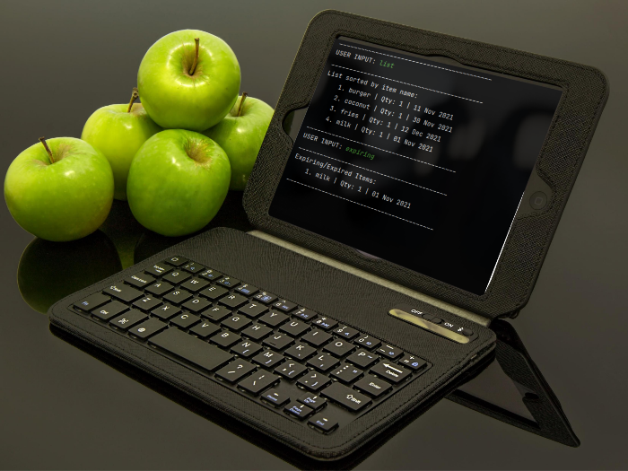

Fridget is a <strong> desktop app built to be used via Command Line Interface </strong> (CLI). Fridget is an easier way for you to keep track of the items in your fridge. It is convenient to add, remove, and find items stored in your fridge. Fridget also reminds you when items are nearing expiry.

If you want to start taking charge of your fridge and stop wasting your food, Fridget is for you.

- Forget scribbling your items on a piece of paper.
- Forget throwing your food away when it goes bad.
- Forget expensive smart fridges that are more trouble than they are worth.

Use Fridget today.

  
*An implementation of Fridget on a tablet*

**Useful links:**
* [User Guide](UserGuide.md)
* [Developer Guide](DeveloperGuide.md)
* [About Us](AboutUs.md)
