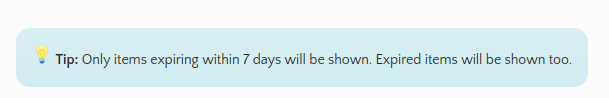

# Alvin Ben Abraham - Project Portfolio Page

## Overview

Nowadays, users need to go through every ingredient in their fridge manually to perform any function related to their fridge. Fridget is a CLI-based application that hopes to automate a lot of the tasks users have relating to the fridge, so that users are able to cook easily and eat healthily.

## Summary of Contributions

### Code Contributed

[<button> Click me to see Alvin's RepoSense page! </button>](https://nus-cs2113-ay2122s1.github.io/tp-dashboard/?search=w12&sort=groupTitle&sortWithin=title&since=2021-09-25&timeframe=commit&mergegroup=&groupSelect=groupByRepos&breakdown=false&tabOpen=true&tabType=authorship&tabAuthor=alvynben&tabRepo=AY2122S1-CS2113T-W12-4%2Ftp%5Bmaster%5D&authorshipIsMergeGroup=false&authorshipFileTypes=docs~functional-code~test-code~other&authorshipIsBinaryFileTypeChecked=false)

### Enhancements Implemented

#### <ins>New Feature: Added the ability to add items into Fridget</ins>

**What does it do? **
Allows the user to add an item (or multiple) into Fridget. 
**Why is it needed? **
It is the backbone of the entire product. The first step for the user will always be to add the items in their fridge into Fridget, so that Fridget can help to keep track of it.  
**Anything special that I did?**

* I went through multiple iterations, as requirements changed (other functions needed more information to perform) which meant a lot of adding and deleting code.
* I improved the method from only adding one item at a time to multiple items at a time.
* I enhanced the method to allow user to specify quantity of items added.
* I edited the code to follow SLAP as much as possible to ensure maintainability even as requirements changed.
* I had to consider a multitude of errors that could affect not only this method, but any silent errors that could cause problems for other functions in Fridget.
* In error handling, I had to consider: 
  * integer overflow 
  * date-time formatting
  * incorrect syntax 
* I had to balance the need to reduce errors, while enabling users the freedom to add the items they needed.

#### <ins>New Feature: Added the ability to remove items from Fridget</ins>

**What does it do? **
Allows the user to remove an item from Fridget by name. 
**Why is it needed? **
It allows users to remove items they do not need or have used. It is a requirement as Fridget acts as a ledger for the user's fridge.  
**Anything special that I did?**
* I had to implement multiple stages so that the user could remove an item by search term, rather than index.

#### <ins>New Feature: Added the ability to find items in Fridget</ins>

**What does it do? **
Allows the user to find an item from Fridget by name. 
**Why is it needed? **
It allows users to check if an item they need is in the Fridge. It reduces the need to manually check whether an item is in the fridge.  

### Contributions to Team-Based Tasks
* Set up the GitHub Team Org/Repo
* Setup Github and Grade Workflows
* Maintained Issue Tracker (in conjunction with rest of team)

### Review/Mentoring Contributions
* Helped to review a considerable amount of PRs and catch a few errors
* Assisted to fix bugs or potential vulnerabilities in other's code
* Helped to fix git issues the team faced

### Contributions to the User Guide
* Wrote the following sections:
  * Introduction
  * Legend
  * Quick Start
  * Features Summary
  * Command Syntax
  * Add an item into Fridget
  * Remove an item from Fridget
  * Find items stored in Fridget
* Developed html elements to display important messages

### Contributions to the Developer Guide
* Wrote the following sections:
  * Quick Start
  * Setting Up In Intellij
  * Index
  * Architecture Components
    * Front End (Ui) Class Diagram
  * Architecture Logic
  * Adding Items Into Fridget
    * All Sequence Diagrams
  * Target User Profile
  * Value Proposition

